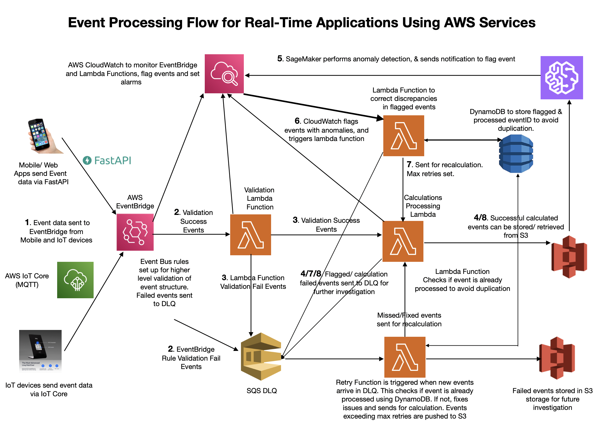

# 🌟 **Event-Driven Architecture for Reliable Event Processing** 🚀 
### 🎯 **Goal** 
Designing a **fault-tolerant, scalable, and automated** event-driven system that: 

- Processes real-time events from **mobile & IoT devices** 📱🔗 
- Ensures **data accuracy** via multi-step validation 🔄 
- Detects **missed**, **incorrectly** **processed** and **anomalies,** and **corrects automatically** 🛠 
- Uses **AWS-native services** for efficiency and monitoring 📊 

## 🔷 **Step 1: Event Generation & Ingestion** 
### 🛜 **Mobile & IoT Devices → AWS EventBridge** 
- Events originate from **mobile/web apps** & **IoT devices**. 
- **EventBridge** serves as the entry point for all events. 
### **Why EventBridge?** 
- **Managed Event Bus** – Handles high throughput with low latency. 
- **Structural Validation** – Ensures event format correctness before further processing. 

#### **Flow:** 

1⃣ Mobile & IoT devices send events to **EventBridge**. 
2⃣ EventBridge applies **basic structural validation** (schema check). 
3⃣ ✅ If valid → Forwarded to the **Lambda Verification Function**. 
4⃣ ❌ If invalid → Sent to **Dead Letter Queue (DLQ) for later review**. 

## 🔷 **Step 2: Event Verification & Processing** 
### 🛡 **AWS Lambda (Verification Lambda) → AWS Lambda (Calculation Lambda)** 
Once an event passes structural validation, it undergoes **further verification** to check: 

- Business logic compliance 
- Required fields and data accuracy 

### **Why Lambda for Verification?** 
- **Serverless & Auto-scaling** – Processes events in parallel. 
- **Low-cost execution** – Runs only when needed. 

#### **Flow:** 

1⃣ **Verification Lambda** checks event details. 
2⃣ ✅ If valid → Sent to **Calculation Lambda** for processing.  
3⃣ ❌ If invalid → Sent to **DLQ for failure handling**. 

### 📊 **AWS Lambda (Calculation Lambda) → Amazon S3** 

Once verified, the event is **processed and stored**.

### **Why Lambda for Calculation?** 
- **On-demand execution** – Auto-scales based on load. 
- **Lightweight & efficient** – No need for dedicated servers. 

### **Why S3 for Storage?** 

- **Cost-effective** – Stores large volumes of event data. 
- **Durability** – 99.999999999% (11 9’s) availability. 

#### **Flow:** 

1⃣ **Calculation Lambda** performs key business logic. 
2⃣ ✅ Successful results are stored in **S3 for long-term storage**. 
3⃣❌ If processing fails → Event goes to **DLQ for later retries**. 

## 🔷 **Step 3: Monitoring & Error Detection** 

### 🔍 **AWS CloudWatch (Error Monitoring & Flagging)**

All **EventBridge, Lambda, and S3** activities are monitored by **CloudWatch**. 

### **Why CloudWatch?** 
- **Observability** – Monitors logs, metrics, and anomalies. 
- **Automation** – Can trigger Lambda for corrections. 

### **Flow:** 
1⃣ CloudWatch **monitors logs and metrics** from EventBridge, Lambda, and S3. 
2⃣ If errors/discrepancies are detected → **Triggers Correction Lambda**.  
3⃣ **Correction Lambda** determines if recalculation is needed. 

## 🔷 **Step 4: Anomaly Detection & Reprocessing**

### 🤖 **Amazon SageMaker (Anomaly Detection)**

- S3-stored event data is **retrieved by SageMaker**. 
- SageMaker’s **ML models** detect **anomalies or incorrect calculations**. 
- If an anomaly is found → **Sends a notification to CloudWatch**. 

### **Why SageMaker?** 
- **Scalable Machine Learning** – Learns from past incorrect events. 
- **Automated Anomaly Detection** – No need for manual tracking. 

#### **Flow:** 
1⃣ SageMaker retrieves processed event data from **S3**.  
2⃣ **ML Model detects anomalies** in calculations.  
3⃣ If anomaly is found → SageMaker sends an **alert to CloudWatch**. 
4⃣ CloudWatch triggers **Correction Lambda** for reprocessing. 

## 🔷 **Step 5: Automated Event Correction & Reprocessing** 

### 🛠 **AWS Lambda (Correction Lambda) → AWS Lambda (Recalculation Lambda)** 

Once an event is flagged, the **Correction Lambda** decides if recalculation is needed. 
- #### **Flow:** 
1⃣ **Correction Lambda** checks DynamoDB for previous corrections.  
2⃣ **If never corrected** → Sent to **Recalculation Lambda**.  
3⃣ **If already corrected once** → Sent to **SQS DLQ** for manual review.   
4⃣ **Successful recalculations** → Overwrite event data in **S3**.  

### **Why DynamoDB?**

- **Tracks correction history** → Prevents infinite loops of retrying. 
- **Fast lookups** → Ensures correction is not repeated unnecessarily. 

## 🔷 **Step 6: Dead Letter Queue (Final Retries & Investigation) ❌ SQS DLQ (Final Retry Mechanism & Investigation Storage)** 

- Events that **fail multiple times** are stored in **DLQ**. 
- A **Lambda function periodically checks DLQ** and retries processing. 
### **Why DLQ?** 
- **Prevents Event Loss** – Stores all failed events for later analysis. 
- **Retry Handling** – Lambda function can **retry events before archiving**. 

## 🔷 **Step 7: Dead Letter Queue (Final Retries & Investigation) ❌ SQS DLQ (Final Retry Mechanism & Investigation Storage)**

All events that **fail validation, processing, or correction** multiple times are stored in **SQS Dead Letter Queue (DLQ)**. 

A **DLQ Processing Lambda** is triggered when events land in the DLQ to attempt a final retry. 

💡 **Why DLQ?** 

- **Prevents Event Loss** – Captures all failed events for analysis. 
- **Automatic Retries** – A Lambda function checks the DLQ and retries processing. 
- **Separation of Concerns** – Ensures failed events do not clog the main processing pipeline. 

- **Flow:** 

1⃣ DLQ stores failed events for later review. 
2⃣ A **Lambda function** is triggered when events are added to DLQ. 
3⃣ Lambda **checks DynamoDB** if the event was already corrected: 
  - ✅ If **not corrected before** → Sent to **Recalculation Lambda**. 
  - ❌ If **already corrected once** → Pushed to **S3 Failure Storage** for manual investigation.  
4⃣ If recalculation is **successful**, the event is **overwritten in S3**. 
5⃣ If **failure persists even after retries**, event is stored permanently in **S3 for manual intervention**. 

## 📌 **AWS Services Used & Why?**

| **AWS Service**        | **Purpose**                                 | **Why Chosen?**                           |
|------------------------|---------------------------------------------|-------------------------------------------|
| **AWS EventBridge**     | Event ingestion & initial validation        | Handles high-throughput events & enables event routing. |
| **AWS Lambda**          | Validation, Processing, Recalculation, Correction | Serverless, auto-scalable, and cost-effective. |
| **AWS S3**              | Event data storage                         | Durable, cost-effective, and allows easy querying via Athena. |
| **AWS CloudWatch**      | Monitoring & automated error detection      | Provides logs, metrics, and automated alerts. |
| **Amazon SageMaker**    | Anomaly detection                           | Uses machine learning to flag incorrect events. |
| **AWS DynamoDB**        | Correction history tracking                 | Ensures no duplicate corrections and fast lookups. |
| **AWS SQS DLQ**         | Failure handling & retries                  | Stores failed events, allows retry logic to be applied. |

## 🔄 **Trade-offs & Limitations**

| **Trade-off**        | **Explanation**                                         | **Possible Solution**                               |
|----------------------|---------------------------------------------------------|-----------------------------------------------------|
| **Processing Delay**  | Additional processing for anomaly detection and correction may increase latency. | Optimize SageMaker models & use batch inference for efficiency. |
| **Cost of SageMaker** | Running real-time anomaly detection in SageMaker can be costly for large-scale events. | Use Athena-based rule checks before sending events to SageMaker. |
| **Storage Growth in S3** | Storing both correct & incorrect events in S3 can lead to high storage costs. | Implement lifecycle policies in S3 to archive old data. |
| **DLQ Growth**        | If too many events land in DLQ, it can cause a backlog in retries. | Use Lambda throttling to control retry rates. |

## 🛠 **Enhanced Approach with Additional Tools** 🔧** 

If I had access to more tools like a **database** (e.g., Amazon RDS or DynamoDB) and **logs**, the approach would evolve to include **historical event storage** for faster recalculations and anomaly detection. By using a database, I could **retrieve past events** more efficiently instead of relying solely on S3, enabling quicker anomaly detection and comparison with historical data. Integrating **OpenSearch (Elasticsearch)** for **log analytics** would provide real-time insights, making error resolution faster and more proactive. Additionally, utilizing **Kinesis** for **real-time streaming** could enhance processing efficiency, enabling **immediate anomaly detection** without needing batch processing, further boosting scalability and responsiveness. 🚀📈

## 📈 **How This Scales to Millions of Events per Hour** 
🚀 **Scalability Considerations:** ✔ **AWS Lambda auto-scales** – Each Lambda execution is independent, so no bottleneck. 

- **EventBridge can process millions of events per second** – Ensures smooth ingestion. 
- **S3’s infinite storage** – Can handle petabytes of event data with no impact on performance. 
- **DynamoDB’s low-latency lookups** – Ensures fast correction history checks. 
- **SageMaker batch processing** – Enables anomaly detection at scale without high costs.
## 🎯 **Key Takeaways** 
- **Highly scalable event-driven system** using AWS-native tools. 
- **No single point of failure** – Everything is decoupled. 
- **Fault-tolerant & self-healing** – DLQ, retries, and anomaly correction ensure events aren’t lost. 
- **Real-time observability** – CloudWatch provides monitoring, triggering corrections when needed. 
- **Intelligent anomaly detection** – SageMaker improves system accuracy over time.

## 📝 **Summary of Workflow** 
📤 **Event Ingestion:** Mobile/IoT → **EventBridge** (Basic validation)  
🔄 **Event Processing:** EventBridge → **Lambda Validation** → **Lambda Calculation** → **S3 Storage**  
📊 **Monitoring:** **CloudWatch** flags errors & **triggers correction Lambda**  
🤖 **Anomaly Detection:** **SageMaker** detects incorrect events → **Sends alert to CloudWatch**  
🛠 **Correction & Recalculation:** **CloudWatch triggers correction Lambda** → **Event reprocessed if needed**  
📌 **Final Failure Handling:** If retry fails → Sent to **SQS DLQ** → **Final retry or push to S3 failure storage** 

### 🔥 **Final Thoughts** 

🎯 This architecture provides **reliability, scalability, and real-time monitoring** for event-driven workloads.  
🚀 **Using AWS-native services ensures** a **cost-effective, serverless, and scalable** solution.  
⚡ **Automated anomaly detection and corrections improve event integrity over time.** 